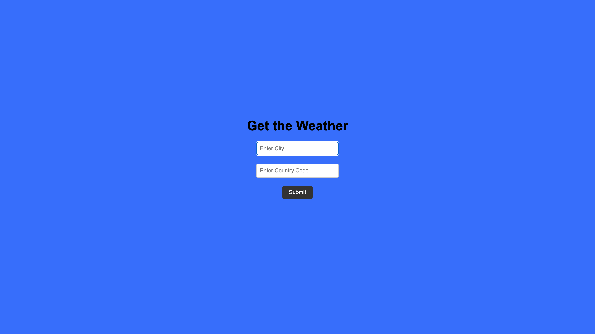

# 🌦 Weather API Project

### Enter a city + country and return the temperature in Fahrenheit



### Tech Used:

- HTML
- CSS
- Javascript
- APIs

### Lessons Learned

- Using APIs to add as part of my project

Example:
```
I completed the challenge: 5
I feel good about my code: 4
Open for any feedback.
```
